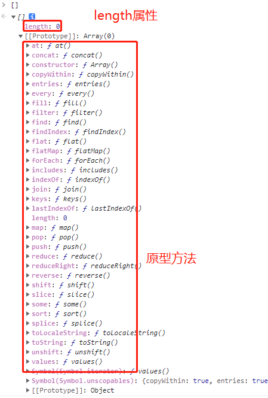

#### 控制台输出的数组




**创建数组的方法**

```javascript
let arr = [,1,23,4,,,]; // 不报错，最后一个逗号忽略
let arr1 = new Array(1,2,3,4,5,); // 报错
```


**数组一些行为不同于对象**

```javascript
Ⅰ. 自动更新`length`。ex：[].push('data')，length会自增
Ⅱ. 当设置`length`值比实际数组长度小的时候，会截断数组
Ⅲ. 类属性是`Array`。ps：就是使用Object.prototype.toString.call([])返回的'[object Array]'
Ⅳ. 从`Array.prototype`继承方法
```


**关于数组的长度length**

```javascript
JavaScript中，数组的长度是32位，最大的索引值是 2^32-2。具有两个特殊行为。

length属性的值永远比最大索引多1
length小于当前数组长度n时，索引值大于或等于n的元素将从中删除。
特别地：数组是对象的特殊形式，用数字索引来访问数组元素一般来说比访问常规的对象属性要快很多，同样地这意味着数组没有“越界”错误的概念。
```


**数组转化为字符串**

```javascript
- 数组转化为`String`类型除了`toString`外，
[1,2,3,4].toString() //'1,2,3,4'
- 还有`join('')`方法
- 还有JSON.stringify()
```


**类数组的原理**

```javascript
- `key`值为数字字符串
- 存在`length`值
let objArr = {
    '2': 3,
    '3': 4,
    length: 2,
    push: Array.prototype.push
}

objArr.push(1);
objArr.push(2);

输出: {
    '2': 1,
    '3': 2,
    length: 4,
    push: Array.prototype.push
}

过程： 
objArr.push(1) -> objArr[objArr.length++] = 1; // 注意了，这里是length++,不是++length
objArr.push(2) -> objArr[objArr.length++] = 2; 
```


**数组的扩展之扩展运算符**

> 扩展运算符（spread）是三个点（`...`）。它好比 rest 参数的逆运算，将一个数组转为用逗号分隔的参数序列。

```javascript
console.log(...[1, 2, 3])
// 1 2 3

console.log(1, ...[2, 3, 4], 5)
// 1 2 3 4 5

[...document.querySelectorAll('div')]
// [<div>, <div>, <div>]
```

该运算符主要用于函数调用。

```javascript
function push(array, ...items) {
  array.push(...items);
}

function add(x, y) {
  return x + y;
}

const numbers = [4, 38];
add(...numbers) // 42
```

上面代码中，`array.push(...items)`和`add(...numbers)`这两行，都是函数的调用，它们的都使用了扩展运算符。该运算符将一个数组，变为参数序列。

扩展运算符与正常的函数参数可以结合使用，非常灵活。

```javascript
function f(v, w, x, y, z) { }
const args = [0, 1];
f(-1, ...args, 2, ...[3]);
```

扩展运算符后面还可以放置表达式。

```javascript
const arr = [
  ...(x > 0 ? ['a'] : []),
  'b',
];
```

如果扩展运算符后面是一个空数组，则不产生任何效果。

```javascript
[...[], 1]
// [1]
```

注意，扩展运算符如果放在括号中，JavaScript 引擎就会认为这是函数调用，否则就会报错。

```javascript
(...[1,2])
// Uncaught SyntaxError: Unexpected number

console.log((...[1,2]))
// Uncaught SyntaxError: Unexpected number
```

上面两种情况都会报错，因为扩展运算符所在的括号不是函数调用，而`console.log(...[1, 2])`就不会报错，因为这时是函数调用。


**替代函数的 apply 方法**

由于扩展运算符可以展开数组，所以不再需要`apply`方法，将数组转为函数的参数了。

```javascript
// ES5 的写法
function f(x, y, z) {
  // ...
}
var args = [0, 1, 2];
f.apply(null, args);

// ES6的写法
function f(x, y, z) {
  // ...
}
let args = [0, 1, 2];
f(...args);
```

下面是扩展运算符取代`apply`方法的一个实际的例子，应用`Math.max`方法，简化求出一个数组最大元素的写法。

```javascript
// ES5 的写法
Math.max.apply(null, [14, 3, 77])

// ES6 的写法
Math.max(...[14, 3, 77])

// 等同于
Math.max(14, 3, 77);
```

上面代码中，由于 JavaScript 不提供求数组最大元素的函数，所以只能套用`Math.max`函数，将数组转为一个参数序列，然后求最大值。有了扩展运算符以后，就可以直接用`Math.max`了。

另一个例子是通过`push`函数，将一个数组添加到另一个数组的尾部。

```javascript
// ES5的 写法
var arr1 = [0, 1, 2];
var arr2 = [3, 4, 5];
Array.prototype.push.apply(arr1, arr2);

// ES6 的写法
let arr1 = [0, 1, 2];
let arr2 = [3, 4, 5];
arr1.push(...arr2);
```

上面代码的 ES5 写法中，`push`方法的参数不能是数组，所以只好通过`apply`方法变通使用`push`方法。有了扩展运算符，就可以直接将数组传入`push`方法。

下面是另外一个例子。

```javascript
// ES5
new (Date.bind.apply(Date, [null, 2015, 1, 1]))
// ES6
new Date(...[2015, 1, 1]);
```


**如何创建一个0-100的数组**

```javascript
Ⅰ. Object.keys([...Array(100)])
Ⅱ. Array.from({ length: 100 }, function () { return this.value++; }, { value: 0 })
```


### 扩展运算符的应用

**（1）复制数组**

数组是复合的数据类型，直接复制的话，只是复制了指向底层数据结构的指针，而不是克隆一个全新的数组。

```javascript
const a1 = [1, 2];
const a2 = a1;

a2[0] = 2;
a1 // [2, 2]
```

上面代码中，`a2`并不是`a1`的克隆，而是指向同一份数据的另一个指针。修改`a2`，会直接导致`a1`的变化。

ES5 只能用变通方法来复制数组。

```javascript
const a1 = [1, 2];
const a2 = a1.concat();

a2[0] = 2;
a1 // [1, 2]
```

上面代码中，`a1`会返回原数组的克隆，再修改`a2`就不会对`a1`产生影响。

扩展运算符提供了复制数组的简便写法。

```javascript
const a1 = [1, 2];
// 写法一
const a2 = [...a1];
// 写法二
const [...a2] = a1;
```

上面的两种写法，`a2`都是`a1`的克隆。


**（2）合并数组**

扩展运算符提供了数组合并的新写法。

```javascript
const arr1 = ['a', 'b'];
const arr2 = ['c'];
const arr3 = ['d', 'e'];

// ES5 的合并数组
arr1.concat(arr2, arr3);
// [ 'a', 'b', 'c', 'd', 'e' ]

// ES6 的合并数组
[...arr1, ...arr2, ...arr3]
// [ 'a', 'b', 'c', 'd', 'e' ]
```

不过，这两种方法都是浅拷贝，使用的时候需要注意。

```javascript
const a1 = [{ foo: 1 }];
const a2 = [{ bar: 2 }];

const a3 = a1.concat(a2);
const a4 = [...a1, ...a2];

a3[0] === a1[0] // true
a4[0] === a1[0] // true
```

上面代码中，`a3`和`a4`是用两种不同方法合并而成的新数组，但是它们的成员都是对原数组成员的引用，这就是浅拷贝。如果修改了原数组的成员，会同步反映到新数组。


**（3）与解构赋值结合**

扩展运算符可以与解构赋值结合起来，用于生成数组。

```javascript
// ES5
a = list[0], rest = list.slice(1)
// ES6
[a, ...rest] = list
```

下面是另外一些例子。

```javascript
const [first, ...rest] = [1, 2, 3, 4, 5];
first // 1
rest  // [2, 3, 4, 5]

const [first, ...rest] = [];
first // undefined
rest  // []

const [first, ...rest] = ["foo"];
first  // "foo"
rest   // []
```

如果将扩展运算符用于数组赋值，只能放在参数的最后一位，否则会报错。

```javascript
const [...butLast, last] = [1, 2, 3, 4, 5];
// 报错

const [first, ...middle, last] = [1, 2, 3, 4, 5];
// 报错
```

**（4）字符串**

扩展运算符还可以将字符串转为真正的数组。

```javascript
[...'hello']
// [ "h", "e", "l", "l", "o" ]
```

上面的写法，有一个重要的好处，那就是能够正确识别四个字节的 Unicode 字符。

```javascript
'x\uD83D\uDE80y'.length // 4
[...'x\uD83D\uDE80y'].length // 3
```

上面代码的第一种写法，JavaScript 会将四个字节的 Unicode 字符，识别为 2 个字符，采用扩展运算符就没有这个问题。因此，正确返回字符串长度的函数，可以像下面这样写。

```javascript
function length(str) {
  return [...str].length;
}

length('x\uD83D\uDE80y') // 3
```

凡是涉及到操作四个字节的 Unicode 字符的函数，都有这个问题。因此，最好都用扩展运算符改写。

```javascript
let str = 'x\uD83D\uDE80y';

str.split('').reverse().join('')
// 'y\uDE80\uD83Dx'

[...str].reverse().join('')
// 'y\uD83D\uDE80x'
```

上面代码中，如果不用扩展运算符，字符串的`reverse`操作就不正确。

**（5）实现了 Iterator 接口的对象**

任何 Iterator 接口的对象（参阅 Iterator 一章），都可以用扩展运算符转为真正的数组。

```javascript
let nodeList = document.querySelectorAll('div');
let array = [...nodeList];
```

上面代码中，`querySelectorAll`方法返回的是一个`NodeList`对象。它不是数组，而是一个类似数组的对象。这时，扩展运算符可以将其转为真正的数组，原因就在于`NodeList`对象实现了 Iterator 。

对于那些没有部署 Iterator 接口的类似数组的对象，扩展运算符就无法将其转为真正的数组。

```javascript
let arrayLike = {
  '0': 'a',
  '1': 'b',
  '2': 'c',
  length: 3
};

// TypeError: Cannot spread non-iterable object.
let arr = [...arrayLike];
```

上面代码中，`arrayLike`是一个类似数组的对象，但是没有部署 Iterator 接口，扩展运算符就会报错。这时，可以改为使用`Array.from`方法将`arrayLike`转为真正的数组。

**（6）Map 和 Set 结构，Generator 函数**

扩展运算符内部调用的是数据结构的 Iterator 接口，因此只要具有 Iterator 接口的对象，都可以使用扩展运算符，比如 Map 结构。

```javascript
let map = new Map([
  [1, 'one'],
  [2, 'two'],
  [3, 'three'],
]);

let arr = [...map.keys()]; // [1, 2, 3]
```

Generator 函数运行后，返回一个遍历器对象，因此也可以使用扩展运算符。

```javascript
const go = function*(){
  yield 1;
  yield 2;
  yield 3;
};

[...go()] // [1, 2, 3]
```

上面代码中，变量`go`是一个 Generator 函数，执行后返回的是一个遍历器对象，对这个遍历器对象执行扩展运算符，就会将内部遍历得到的值，转为一个数组。

如果对没有 Iterator 接口的对象，使用扩展运算符，将会报错。

```javascript
const obj = {a: 1, b: 2};
let arr = [...obj]; // TypeError: Cannot spread non-iterable object
```


**Array.from()**

`Array.from`方法用于将两类对象转为真正的数组：类似数组的对象（array-like object）和可遍历（iterable）的对象（包括 ES6 新增的数据结构 Set 和 Map）。

下面是一个类似数组的对象，`Array.from`将它转为真正的数组。

```javascript
let arrayLike = {
    '0': 'a',
    '1': 'b',
    '2': 'c',
    length: 3
};

// ES5的写法
var arr1 = [].slice.call(arrayLike); // ['a', 'b', 'c']

// ES6的写法
let arr2 = Array.from(arrayLike); // ['a', 'b', 'c']
```

实际应用中，常见的类似数组的对象是 DOM 操作返回的 NodeList 集合，以及函数内部的`arguments`对象。`Array.from`都可以将它们转为真正的数组。

```javascript
// NodeList对象
let ps = document.querySelectorAll('p');
Array.from(ps).filter(p => {
  return p.textContent.length > 100;
});

// arguments对象
function foo() {
  var args = Array.from(arguments);
  // ...
}
```

上面代码中，`querySelectorAll`方法返回的是一个类似数组的对象，可以将这个对象转为真正的数组，再使用`filter`方法。

只要是部署了 Iterator 接口的数据结构，`Array.from`都能将其转为数组。

```javascript
Array.from('hello')
// ['h', 'e', 'l', 'l', 'o']

let namesSet = new Set(['a', 'b'])
Array.from(namesSet) // ['a', 'b']
```

上面代码中，字符串和 Set 结构都具有 Iterator 接口，因此可以被`Array.from`转为真正的数组。

如果参数是一个真正的数组，`Array.from`会返回一个一模一样的新数组。

```javascript
Array.from([1, 2, 3])
// [1, 2, 3]
```

值得提醒的是，扩展运算符（`...`）也可以将某些数据结构转为数组。

```javascript
// arguments对象
function foo() {
  const args = [...arguments];
}

// NodeList对象
[...document.querySelectorAll('div')]
```

扩展运算符背后调用的是遍历器接口（`Symbol.iterator`），如果一个对象没有部署这个接口，就无法转换。`Array.from`方法还支持类似数组的对象。所谓类似数组的对象，本质特征只有一点，即必须有`length`属性。因此，任何有`length`属性的对象，都可以通过`Array.from`方法转为数组，而此时扩展运算符就无法转换。

```javascript
Array.from({ length: 3 });
// [ undefined, undefined, undefined ]
```

上面代码中，`Array.from`返回了一个具有三个成员的数组，每个位置的值都是`undefined`。扩展运算符转换不了这个对象。

对于还没有部署该方法的浏览器，可以用`Array.prototype.slice`方法替代。

```javascript
const toArray = (() =>
  Array.from ? Array.from : obj => [].slice.call(obj)
)();
```

`Array.from`还可以接受第二个参数，作用类似于数组的`map`方法，用来对每个元素进行处理，将处理后的值放入返回的数组。

```javascript
Array.from(arrayLike, x => x * x);
// 等同于
Array.from(arrayLike).map(x => x * x);

Array.from([1, 2, 3], (x) => x * x)
// [1, 4, 9]
```

下面的例子是取出一组 DOM 节点的文本内容。

```javascript
let spans = document.querySelectorAll('span.name');

// map()
let names1 = Array.prototype.map.call(spans, s => s.textContent);

// Array.from()
let names2 = Array.from(spans, s => s.textContent)
```

下面的例子将数组中布尔值为`false`的成员转为`0`。

```javascript
Array.from([1, , 2, , 3], (n) => n || 0)
// [1, 0, 2, 0, 3]
```

另一个例子是返回各种数据的类型。

```javascript
function typesOf () {
  return Array.from(arguments, value => typeof value)
}
typesOf(null, [], NaN)
// ['object', 'object', 'number']
```

如果`map`函数里面用到了`this`关键字，还可以传入`Array.from`的第三个参数，用来绑定`this`。

`Array.from()`可以将各种值转为真正的数组，并且还提供`map`功能。这实际上意味着，只要有一个原始的数据结构，你就可以先对它的值进行处理，然后转成规范的数组结构，进而就可以使用数量众多的数组方法。

```javascript
Array.from({ length: 2 }, () => 'jack')
// ['jack', 'jack']
```

上面代码中，`Array.from`的第一个参数指定了第二个参数运行的次数。这种特性可以让该方法的用法变得非常灵活。

`Array.from()`的另一个应用是，将字符串转为数组，然后返回字符串的长度。因为它能正确处理各种 Unicode 字符，可以避免 JavaScript 将大于`\uFFFF`的 Unicode 字符，算作两个字符的 bug。

```javascript
function countSymbols(string) {
  return Array.from(string).length;
}
```


**Array.of()**

`Array.of`方法用于将一组值，转换为数组。

```javascript
Array.of(3, 11, 8) // [3,11,8]
Array.of(3) // [3]
Array.of(3).length // 1
```

这个方法的主要目的，是弥补数组构造函数`Array()`的不足。因为参数个数的不同，会导致`Array()`的行为有差异。

```javascript
Array() // []
Array(3) // [, , ,]
Array(3, 11, 8) // [3, 11, 8]
```

上面代码中，`Array`方法没有参数、一个参数、三个参数时，返回结果都不一样。只有当参数个数不少于 2 个时，`Array()`才会返回由参数组成的新数组。参数个数只有一个时，实际上是指定数组的长度。

`Array.of`基本上可以用来替代`Array()`或`new Array()`，并且不存在由于参数不同而导致的重载。它的行为非常统一。

```javascript
Array.of() // []
Array.of(undefined) // [undefined]
Array.of(1) // [1]
Array.of(1, 2) // [1, 2]
```

`Array.of`总是返回参数值组成的数组。如果没有参数，就返回一个空数组。

`Array.of`方法可以用下面的代码模拟实现。

```javascript
function ArrayOf(){
  return [].slice.call(arguments);
}
```


**数组实例的 copyWithin()**

数组实例的`copyWithin`方法，在当前数组内部，将指定位置的成员复制到其他位置（会覆盖原有成员），然后返回当前数组。也就是说，使用这个方法，会修改当前数组。

```javascript
Array.prototype.copyWithin(target, start = 0, end = this.length)
```

它接受三个参数。

- target（必需）：从该位置开始替换数据。如果为负值，表示倒数。
- start（可选）：从该位置开始读取数据，默认为 0。如果为负值，表示倒数。
- end（可选）：到该位置前停止读取数据，默认等于数组长度。如果为负值，表示倒数。

这三个参数都应该是数值，如果不是，会自动转为数值。

```javascript
[1, 2, 3, 4, 5].copyWithin(0, 3)
// [4, 5, 3, 4, 5]
```

上面代码表示将从 3 号位直到数组结束的成员（4 和 5），复制到从 0 号位开始的位置，结果覆盖了原来的 1 和 2。

下面是更多例子。

```javascript
// 将3号位复制到0号位
[1, 2, 3, 4, 5].copyWithin(0, 3, 4)
// [4, 2, 3, 4, 5]

// -2相当于3号位，-1相当于4号位
[1, 2, 3, 4, 5].copyWithin(0, -2, -1)
// [4, 2, 3, 4, 5]

// 将3号位复制到0号位
[].copyWithin.call({length: 5, 3: 1}, 0, 3)
// {0: 1, 3: 1, length: 5}

// 将2号位到数组结束，复制到0号位
let i32a = new Int32Array([1, 2, 3, 4, 5]);
i32a.copyWithin(0, 2);
// Int32Array [3, 4, 5, 4, 5]

// 对于没有部署 TypedArray 的 copyWithin 方法的平台
// 需要采用下面的写法
[].copyWithin.call(new Int32Array([1, 2, 3, 4, 5]), 0, 3, 4);
// Int32Array [4, 2, 3, 4, 5]
```


**数组实例的 find() 和 findIndex()**

数组实例的`find`方法，用于找出第一个符合条件的数组成员。它的参数是一个回调函数，所有数组成员依次执行该回调函数，直到找出第一个返回值为`true`的成员，然后返回该成员。如果没有符合条件的成员，则返回`undefined`。

```javascript
[1, 4, -5, 10].find((n) => n < 0)
// -5
```

上面代码找出数组中第一个小于 0 的成员。

```javascript
[1, 5, 10, 15].find(function(value, index, arr) {
  return value > 9;
}) // 10
```

上面代码中，`find`方法的回调函数可以接受三个参数，依次为当前的值、当前的位置和原数组。

数组实例的`findIndex`方法的用法与`find`方法非常类似，返回第一个符合条件的数组成员的位置，如果所有成员都不符合条件，则返回`-1`。

```javascript
[1, 5, 10, 15].findIndex(function(value, index, arr) {
  return value > 9;
}) // 2
```

这两个方法都可以接受第二个参数，用来绑定回调函数的`this`对象。

```javascript
function f(v){
  return v > this.age;
}
let person = {name: 'John', age: 20};
[10, 12, 26, 15].find(f, person);    // 26
```

上面的代码中，`find`函数接收了第二个参数`person`对象，回调函数中的`this`对象指向`person`对象。

另外，这两个方法都可以发现`NaN`，弥补了数组的`indexOf`方法的不足。

```javascript
[NaN].indexOf(NaN)
// -1

[NaN].findIndex(y => Object.is(NaN, y))
// 0
```

上面代码中，`indexOf`方法无法识别数组的`NaN`成员，但是`findIndex`方法可以借助`Object.is`方法做到。


**数组实例的 fill()**

`fill`方法使用给定值，填充一个数组。

```javascript
['a', 'b', 'c'].fill(7)
// [7, 7, 7]

new Array(3).fill(7)
// [7, 7, 7]
```

上面代码表明，`fill`方法用于空数组的初始化非常方便。数组中已有的元素，会被全部抹去。

`fill`方法还可以接受第二个和第三个参数，用于指定填充的起始位置和结束位置。

```javascript
['a', 'b', 'c'].fill(7, 1, 2)
// ['a', 7, 'c']
```

上面代码表示，`fill`方法从 1 号位开始，向原数组填充 7，到 2 号位之前结束。

注意，如果填充的类型为对象，那么被赋值的是同一个内存地址的对象，而不是深拷贝对象。

```javascript
let arr = new Array(3).fill({name: "Mike"});
arr[0].name = "Ben";
arr
// [{name: "Ben"}, {name: "Ben"}, {name: "Ben"}]

let arr = new Array(3).fill([]);
arr[0].push(5);
arr
// [[5], [5], [5]]
```


**数组实例的 entries()，keys() 和 values()**

ES6 提供三个新的方法——`entries()`，`keys()`和`values()`——用于遍历数组。它们都返回一个遍历器对象（详见《Iterator》一章），可以用`for...of`循环进行遍历，唯一的区别是`keys()`是对键名的遍历、`values()`是对键值的遍历，`entries()`是对键值对的遍历。

```javascript
for (let index of ['a', 'b'].keys()) {
  console.log(index);
}
// 0
// 1

for (let elem of ['a', 'b'].values()) {
  console.log(elem);
}
// 'a'
// 'b'

for (let [index, elem] of ['a', 'b'].entries()) {
  console.log(index, elem);
}
// 0 "a"
// 1 "b"
```

如果不使用`for...of`循环，可以手动调用遍历器对象的`next`方法，进行遍历。

```javascript
let letter = ['a', 'b', 'c'];
let entries = letter.entries();
console.log(entries.next().value); // [0, 'a']
console.log(entries.next().value); // [1, 'b']
console.log(entries.next().value); // [2, 'c']
```


**数组实例的 includes()**

`Array.prototype.includes`方法返回一个布尔值，表示某个数组是否包含给定的值，与字符串的`includes`方法类似。ES2016 引入了该方法。

```javascript
[1, 2, 3].includes(2)     // true
[1, 2, 3].includes(4)     // false
[1, 2, NaN].includes(NaN) // true
```

该方法的第二个参数表示搜索的起始位置，默认为`0`。如果第二个参数为负数，则表示倒数的位置，如果这时它大于数组长度（比如第二个参数为`-4`，但数组长度为`3`），则会重置为从`0`开始。

```javascript
[1, 2, 3].includes(3, 3);  // false
[1, 2, 3].includes(3, -1); // true
```

没有该方法之前，我们通常使用数组的`indexOf`方法，检查是否包含某个值。

```javascript
if (arr.indexOf(el) !== -1) {
  // ...
}
```

`indexOf`方法有两个缺点，一是不够语义化，它的含义是找到参数值的第一个出现位置，所以要去比较是否不等于`-1`，表达起来不够直观。二是，它内部使用严格相等运算符（`===`）进行判断，这会导致对`NaN`的误判。

```javascript
[NaN].indexOf(NaN)
// -1
```

`includes`使用的是不一样的判断算法，就没有这个问题。

```javascript
[NaN].includes(NaN)
// true
```

下面代码用来检查当前环境是否支持该方法，如果不支持，部署一个简易的替代版本。

```javascript
const contains = (() =>
  Array.prototype.includes
    ? (arr, value) => arr.includes(value)
    : (arr, value) => arr.some(el => el === value)
)();
contains(['foo', 'bar'], 'baz'); // => false
```

另外，Map 和 Set 数据结构有一个`has`方法，需要注意与`includes`区分。

- Map 结构的`has`方法，是用来查找键名的，比如`Map.prototype.has(key)`、`WeakMap.prototype.has(key)`、`Reflect.has(target, propertyKey)`。
- Set 结构的`has`方法，是用来查找值的，比如`Set.prototype.has(value)`、`WeakSet.prototype.has(value)`。


**数组实例的 flat()，flatMap()**

数组的成员有时还是数组，`Array.prototype.flat()`用于将嵌套的数组“拉平”，变成一维的数组。该方法返回一个新数组，对原数据没有影响。

```javascript
[1, 2, [3, 4]].flat()
// [1, 2, 3, 4]
```

上面代码中，原数组的成员里面有一个数组，`flat()`方法将子数组的成员取出来，添加在原来的位置。

`flat()`默认只会“拉平”一层，如果想要“拉平”多层的嵌套数组，可以将`flat()`方法的参数写成一个整数，表示想要拉平的层数，默认为1。

```javascript
[1, 2, [3, [4, 5]]].flat()
// [1, 2, 3, [4, 5]]

[1, 2, [3, [4, 5]]].flat(2)
// [1, 2, 3, 4, 5]
```

上面代码中，`flat()`的参数为2，表示要“拉平”两层的嵌套数组。

如果不管有多少层嵌套，都要转成一维数组，可以用`Infinity`关键字作为参数。

```javascript
[1, [2, [3]]].flat(Infinity)
// [1, 2, 3]
```

如果原数组有空位，`flat()`方法会跳过空位。

```javascript
[1, 2, , 4, 5].flat()
// [1, 2, 4, 5]
```

`flatMap()`方法对原数组的每个成员执行一个函数（相当于执行`Array.prototype.map()`），然后对返回值组成的数组执行`flat()`方法。该方法返回一个新数组，不改变原数组。

```javascript
// 相当于 [[2, 4], [3, 6], [4, 8]].flat()
[2, 3, 4].flatMap((x) => [x, x * 2])
// [2, 4, 3, 6, 4, 8]
```

`flatMap()`只能展开一层数组。

```javascript
// 相当于 [[[2]], [[4]], [[6]], [[8]]].flat()
[1, 2, 3, 4].flatMap(x => [[x * 2]])
// [[2], [4], [6], [8]]
```

上面代码中，遍历函数返回的是一个双层的数组，但是默认只能展开一层，因此`flatMap()`返回的还是一个嵌套数组。

`flatMap()`方法的参数是一个遍历函数，该函数可以接受三个参数，分别是当前数组成员、当前数组成员的位置（从零开始）、原数组。

```javascript
arr.flatMap(function callback(currentValue[, index[, array]]) {
  // ...
}[, thisArg])
```

`flatMap()`方法还可以有第二个参数，用来绑定遍历函数里面的`this`。


**数组的空位**

数组的空位指，数组的某一个位置没有任何值。比如，`Array`构造函数返回的数组都是空位。

```javascript
Array(3) // [, , ,]
```

上面代码中，`Array(3)`返回一个具有 3 个空位的数组。

注意，空位不是`undefined`，一个位置的值等于`undefined`，依然是有值的。空位是没有任何值，`in`运算符可以说明这一点。

```javascript
0 in [undefined, undefined, undefined] // true
0 in [, , ,] // false
```

上面代码说明，第一个数组的 0 号位置是有值的，第二个数组的 0 号位置没有值。

ES5 对空位的处理，已经很不一致了，大多数情况下会忽略空位。

- `forEach()`, `filter()`, `reduce()`, `every()` 和`some()`都会跳过空位。
- `map()`会跳过空位，但会保留这个值
- `join()`和`toString()`会将空位视为`undefined`，而`undefined`和`null`会被处理成空字符串。

```javascript
// forEach方法
[,'a'].forEach((x,i) => console.log(i)); // 1

// filter方法
['a',,'b'].filter(x => true) // ['a','b']

// every方法
[,'a'].every(x => x==='a') // true

// reduce方法
[1,,2].reduce((x,y) => x+y) // 3

// some方法
[,'a'].some(x => x !== 'a') // false

// map方法
[,'a'].map(x => 1) // [,1]

// join方法
[,'a',undefined,null].join('#') // "#a##"

// toString方法
[,'a',undefined,null].toString() // ",a,,"
```

ES6 则是明确将空位转为`undefined`。

`Array.from`方法会将数组的空位，转为`undefined`，也就是说，这个方法不会忽略空位。

```javascript
Array.from(['a',,'b'])
// [ "a", undefined, "b" ]
```

扩展运算符（`...`）也会将空位转为`undefined`。

```javascript
[...['a',,'b']]
// [ "a", undefined, "b" ]
```

`copyWithin()`会连空位一起拷贝。

```javascript
[,'a','b',,].copyWithin(2,0) // [,"a",,"a"]
```

`fill()`会将空位视为正常的数组位置。

```javascript
new Array(3).fill('a') // ["a","a","a"]
```

`for...of`循环也会遍历空位。

```javascript
let arr = [, ,];
for (let i of arr) {
  console.log(1);
}
// 1
// 1
```

上面代码中，数组`arr`有两个空位，`for...of`并没有忽略它们。如果改成`map`方法遍历，空位是会跳过的。

`entries()`、`keys()`、`values()`、`find()`和`findIndex()`会将空位处理成`undefined`。

```javascript
// entries()
[...[,'a'].entries()] // [[0,undefined], [1,"a"]]

// keys()
[...[,'a'].keys()] // [0,1]

// values()
[...[,'a'].values()] // [undefined,"a"]

// find()
[,'a'].find(x => true) // undefined

// findIndex()
[,'a'].findIndex(x => true) // 0
```

由于空位的处理规则非常不统一，所以建议避免出现空位。


# ArrayBuffer

`ArrayBuffer`对象、`TypedArray`视图和`DataView`视图是 JavaScript 操作二进制数据的一个接口。这些对象早就存在，属于独立的规格（2011 年 2 月发布），ES6 将它们纳入了 ECMAScript 规格，并且增加了新的方法。它们都是以数组的语法处理二进制数据，所以统称为二进制数组。

这个接口的原始设计目的，与 WebGL 项目有关。所谓 WebGL，就是指浏览器与显卡之间的通信接口，为了满足 JavaScript 与显卡之间大量的、实时的数据交换，它们之间的数据通信必须是二进制的，而不能是传统的文本格式。文本格式传递一个 32 位整数，两端的 JavaScript 脚本与显卡都要进行格式转化，将非常耗时。这时要是存在一种机制，可以像 C 语言那样，直接操作字节，将 4 个字节的 32 位整数，以二进制形式原封不动地送入显卡，脚本的性能就会大幅提升。

二进制数组就是在这种背景下诞生的。它很像 C 语言的数组，允许开发者以数组下标的形式，直接操作内存，大大增强了 JavaScript 处理二进制数据的能力，使得开发者有可能通过 JavaScript 与操作系统的原生接口进行二进制通信。

二进制数组由三类对象组成。

**（1）`ArrayBuffer`对象**：代表内存之中的一段二进制数据，可以通过“视图”进行操作。“视图”部署了数组接口，这意味着，可以用数组的方法操作内存。

**（2）`TypedArray`视图**：共包括 9 种类型的视图，比如`Uint8Array`（无符号 8 位整数）数组视图, `Int16Array`（16 位整数）数组视图, `Float32Array`（32 位浮点数）数组视图等等。

**（3）`DataView`视图**：可以自定义复合格式的视图，比如第一个字节是 Uint8（无符号 8 位整数）、第二、三个字节是 Int16（16 位整数）、第四个字节开始是 Float32（32 位浮点数）等等，此外还可以自定义字节序。

简单说，`ArrayBuffer`对象代表原始的二进制数据，`TypedArray`视图用来读写简单类型的二进制数据，`DataView`视图用来读写复杂类型的二进制数据。

`TypedArray`视图支持的数据类型一共有 9 种（`DataView`视图支持除`Uint8C`以外的其他 8 种）。

| 数据类型 | 字节长度 | 含义                             | 对应的 C 语言类型 |
| -------- | -------- | -------------------------------- | ----------------- |
| Int8     | 1        | 8 位带符号整数                   | signed char       |
| Uint8    | 1        | 8 位不带符号整数                 | unsigned char     |
| Uint8C   | 1        | 8 位不带符号整数（自动过滤溢出） | unsigned char     |
| Int16    | 2        | 16 位带符号整数                  | short             |
| Uint16   | 2        | 16 位不带符号整数                | unsigned short    |
| Int32    | 4        | 32 位带符号整数                  | int               |
| Uint32   | 4        | 32 位不带符号的整数              | unsigned int      |
| Float32  | 4        | 32 位浮点数                      | float             |
| Float64  | 8        | 64 位浮点数                      | double            |

注意，二进制数组并不是真正的数组，而是类似数组的对象。

很多浏览器操作的 API，用到了二进制数组操作二进制数据，下面是其中的几个。

- File API
- XMLHttpRequest
- Fetch API
- Canvas
- WebSockets

## ArrayBuffer 对象

### 概述

`ArrayBuffer`对象代表储存二进制数据的一段内存，它不能直接读写，只能通过视图（`TypedArray`视图和`DataView`视图)来读写，视图的作用是以指定格式解读二进制数据。

`ArrayBuffer`也是一个构造函数，可以分配一段可以存放数据的连续内存区域。

```javascript
const buf = new ArrayBuffer(32);
```

上面代码生成了一段 32 字节的内存区域，每个字节的值默认都是 0。可以看到，`ArrayBuffer`构造函数的参数是所需要的内存大小（单位字节）。

为了读写这段内容，需要为它指定视图。`DataView`视图的创建，需要提供`ArrayBuffer`对象实例作为参数。

```javascript
const buf = new ArrayBuffer(32);
const dataView = new DataView(buf);
dataView.getUint8(0) // 0
```

上面代码对一段 32 字节的内存，建立`DataView`视图，然后以不带符号的 8 位整数格式，从头读取 8 位二进制数据，结果得到 0，因为原始内存的`ArrayBuffer`对象，默认所有位都是 0。

另一种`TypedArray`视图，与`DataView`视图的一个区别是，它不是一个构造函数，而是一组构造函数，代表不同的数据格式。

```javascript
const buffer = new ArrayBuffer(12);

const x1 = new Int32Array(buffer);
x1[0] = 1;
const x2 = new Uint8Array(buffer);
x2[0]  = 2;

x1[0] // 2
```

上面代码对同一段内存，分别建立两种视图：32 位带符号整数（`Int32Array`构造函数）和 8 位不带符号整数（`Uint8Array`构造函数）。由于两个视图对应的是同一段内存，一个视图修改底层内存，会影响到另一个视图。

`TypedArray`视图的构造函数，除了接受`ArrayBuffer`实例作为参数，还可以接受普通数组作为参数，直接分配内存生成底层的`ArrayBuffer`实例，并同时完成对这段内存的赋值。

```javascript
const typedArray = new Uint8Array([0,1,2]);
typedArray.length // 3

typedArray[0] = 5;
typedArray // [5, 1, 2]
```

上面代码使用`TypedArray`视图的`Uint8Array`构造函数，新建一个不带符号的 8 位整数视图。可以看到，`Uint8Array`直接使用普通数组作为参数，对底层内存的赋值同时完成。

### ArrayBuffer.prototype.byteLength

`ArrayBuffer`实例的`byteLength`属性，返回所分配的内存区域的字节长度。

```javascript
const buffer = new ArrayBuffer(32);
buffer.byteLength
// 32
```

如果要分配的内存区域很大，有可能分配失败（因为没有那么多的连续空余内存），所以有必要检查是否分配成功。

```javascript
if (buffer.byteLength === n) {
  // 成功
} else {
  // 失败
}
```

### ArrayBuffer.prototype.slice()

`ArrayBuffer`实例有一个`slice`方法，允许将内存区域的一部分，拷贝生成一个新的`ArrayBuffer`对象。

```javascript
const buffer = new ArrayBuffer(8);
const newBuffer = buffer.slice(0, 3);
```

上面代码拷贝`buffer`对象的前 3 个字节（从 0 开始，到第 3 个字节前面结束），生成一个新的`ArrayBuffer`对象。`slice`方法其实包含两步，第一步是先分配一段新内存，第二步是将原来那个`ArrayBuffer`对象拷贝过去。

`slice`方法接受两个参数，第一个参数表示拷贝开始的字节序号（含该字节），第二个参数表示拷贝截止的字节序号（不含该字节）。如果省略第二个参数，则默认到原`ArrayBuffer`对象的结尾。

除了`slice`方法，`ArrayBuffer`对象不提供任何直接读写内存的方法，只允许在其上方建立视图，然后通过视图读写。

### ArrayBuffer.isView()

`ArrayBuffer`有一个静态方法`isView`，返回一个布尔值，表示参数是否为`ArrayBuffer`的视图实例。这个方法大致相当于判断参数，是否为`TypedArray`实例或`DataView`实例。

```javascript
const buffer = new ArrayBuffer(8);
ArrayBuffer.isView(buffer) // false

const v = new Int32Array(buffer);
ArrayBuffer.isView(v) // true
```


## TypedArray 视图

### 概述

`ArrayBuffer`对象作为内存区域，可以存放多种类型的数据。同一段内存，不同数据有不同的解读方式，这就叫做“视图”（view）。`ArrayBuffer`有两种视图，一种是`TypedArray`视图，另一种是`DataView`视图。前者的数组成员都是同一个数据类型，后者的数组成员可以是不同的数据类型。

目前，`TypedArray`视图一共包括 9 种类型，每一种视图都是一种构造函数。

- **`Int8Array`**：8 位有符号整数，长度 1 个字节。
- **`Uint8Array`**：8 位无符号整数，长度 1 个字节。
- **`Uint8ClampedArray`**：8 位无符号整数，长度 1 个字节，溢出处理不同。
- **`Int16Array`**：16 位有符号整数，长度 2 个字节。
- **`Uint16Array`**：16 位无符号整数，长度 2 个字节。
- **`Int32Array`**：32 位有符号整数，长度 4 个字节。
- **`Uint32Array`**：32 位无符号整数，长度 4 个字节。
- **`Float32Array`**：32 位浮点数，长度 4 个字节。
- **`Float64Array`**：64 位浮点数，长度 8 个字节。

这 9 个构造函数生成的数组，统称为`TypedArray`视图。它们很像普通数组，都有`length`属性，都能用方括号运算符（`[]`）获取单个元素，所有数组的方法，在它们上面都能使用。普通数组与 TypedArray 数组的差异主要在以下方面。

- TypedArray 数组的所有成员，都是同一种类型。
- TypedArray 数组的成员是连续的，不会有空位。
- TypedArray 数组成员的默认值为 0。比如，`new Array(10)`返回一个普通数组，里面没有任何成员，只是 10 个空位；`new Uint8Array(10)`返回一个 TypedArray 数组，里面 10 个成员都是 0。
- TypedArray 数组只是一层视图，本身不储存数据，它的数据都储存在底层的`ArrayBuffer`对象之中，要获取底层对象必须使用`buffer`属性。


### 构造函数

TypedArray 数组提供 9 种构造函数，用来生成相应类型的数组实例。

构造函数有多种用法。

**（1）TypedArray(buffer, byteOffset=0, length?)**

同一个`ArrayBuffer`对象之上，可以根据不同的数据类型，建立多个视图。

```javascript
// 创建一个8字节的ArrayBuffer
const b = new ArrayBuffer(8);

// 创建一个指向b的Int32视图，开始于字节0，直到缓冲区的末尾
const v1 = new Int32Array(b);

// 创建一个指向b的Uint8视图，开始于字节2，直到缓冲区的末尾
const v2 = new Uint8Array(b, 2);

// 创建一个指向b的Int16视图，开始于字节2，长度为2
const v3 = new Int16Array(b, 2, 2);
```

上面代码在一段长度为 8 个字节的内存（`b`）之上，生成了三个视图：`v1`、`v2`和`v3`。

视图的构造函数可以接受三个参数：

- 第一个参数（必需）：视图对应的底层`ArrayBuffer`对象。
- 第二个参数（可选）：视图开始的字节序号，默认从 0 开始。
- 第三个参数（可选）：视图包含的数据个数，默认直到本段内存区域结束。

因此，`v1`、`v2`和`v3`是重叠的：`v1[0]`是一个 32 位整数，指向字节 0 ～字节 3；`v2[0]`是一个 8 位无符号整数，指向字节 2；`v3[0]`是一个 16 位整数，指向字节 2 ～字节 3。只要任何一个视图对内存有所修改，就会在另外两个视图上反应出来。

注意，`byteOffset`必须与所要建立的数据类型一致，否则会报错。

```javascript
const buffer = new ArrayBuffer(8);
const i16 = new Int16Array(buffer, 1);
// Uncaught RangeError: start offset of Int16Array should be a multiple of 2
```

上面代码中，新生成一个 8 个字节的`ArrayBuffer`对象，然后在这个对象的第一个字节，建立带符号的 16 位整数视图，结果报错。因为，带符号的 16 位整数需要两个字节，所以`byteOffset`参数必须能够被 2 整除。

如果想从任意字节开始解读`ArrayBuffer`对象，必须使用`DataView`视图，因为`TypedArray`视图只提供 9 种固定的解读格式。

**（2）TypedArray(length)**

视图还可以不通过`ArrayBuffer`对象，直接分配内存而生成。

```javascript
const f64a = new Float64Array(8);
f64a[0] = 10;
f64a[1] = 20;
f64a[2] = f64a[0] + f64a[1];
```

上面代码生成一个 8 个成员的`Float64Array`数组（共 64 字节），然后依次对每个成员赋值。这时，视图构造函数的参数就是成员的个数。可以看到，视图数组的赋值操作与普通数组的操作毫无两样。

**（3）TypedArray(typedArray)**

TypedArray 数组的构造函数，可以接受另一个`TypedArray`实例作为参数。

```javascript
const typedArray = new Int8Array(new Uint8Array(4));
```

上面代码中，`Int8Array`构造函数接受一个`Uint8Array`实例作为参数。

注意，此时生成的新数组，只是复制了参数数组的值，对应的底层内存是不一样的。新数组会开辟一段新的内存储存数据，不会在原数组的内存之上建立视图。

```javascript
const x = new Int8Array([1, 1]);
const y = new Int8Array(x);
x[0] // 1
y[0] // 1

x[0] = 2;
y[0] // 1
```

上面代码中，数组`y`是以数组`x`为模板而生成的，当`x`变动的时候，`y`并没有变动。

如果想基于同一段内存，构造不同的视图，可以采用下面的写法。

```javascript
const x = new Int8Array([1, 1]);
const y = new Int8Array(x.buffer);
x[0] // 1
y[0] // 1

x[0] = 2;
y[0] // 2
```

**（4）TypedArray(arrayLikeObject)**

构造函数的参数也可以是一个普通数组，然后直接生成`TypedArray`实例。

```javascript
const typedArray = new Uint8Array([1, 2, 3, 4]);
```

注意，这时`TypedArray`视图会重新开辟内存，不会在原数组的内存上建立视图。

上面代码从一个普通的数组，生成一个 8 位无符号整数的`TypedArray`实例。

TypedArray 数组也可以转换回普通数组。

```javascript
const normalArray = [...typedArray];
// or
const normalArray = Array.from(typedArray);
// or
const normalArray = Array.prototype.slice.call(typedArray);
```

### 数组方法

普通数组的操作方法和属性，对 TypedArray 数组完全适用。

- `TypedArray.prototype.copyWithin(target, start[, end = this.length])`
- `TypedArray.prototype.entries()`
- `TypedArray.prototype.every(callbackfn, thisArg?)`
- `TypedArray.prototype.fill(value, start=0, end=this.length)`
- `TypedArray.prototype.filter(callbackfn, thisArg?)`
- `TypedArray.prototype.find(predicate, thisArg?)`
- `TypedArray.prototype.findIndex(predicate, thisArg?)`
- `TypedArray.prototype.forEach(callbackfn, thisArg?)`
- `TypedArray.prototype.indexOf(searchElement, fromIndex=0)`
- `TypedArray.prototype.join(separator)`
- `TypedArray.prototype.keys()`
- `TypedArray.prototype.lastIndexOf(searchElement, fromIndex?)`
- `TypedArray.prototype.map(callbackfn, thisArg?)`
- `TypedArray.prototype.reduce(callbackfn, initialValue?)`
- `TypedArray.prototype.reduceRight(callbackfn, initialValue?)`
- `TypedArray.prototype.reverse()`
- `TypedArray.prototype.slice(start=0, end=this.length)`
- `TypedArray.prototype.some(callbackfn, thisArg?)`
- `TypedArray.prototype.sort(comparefn)`
- `TypedArray.prototype.toLocaleString(reserved1?, reserved2?)`
- `TypedArray.prototype.toString()`
- `TypedArray.prototype.values()`

上面所有方法的用法，请参阅数组方法的介绍，这里不再重复了。

注意，TypedArray 数组没有`concat`方法。如果想要合并多个 TypedArray 数组，可以用下面这个函数。

```javascript
function concatenate(resultConstructor, ...arrays) {
  let totalLength = 0;
  for (let arr of arrays) {
    totalLength += arr.length;
  }
  let result = new resultConstructor(totalLength);
  let offset = 0;
  for (let arr of arrays) {
    result.set(arr, offset);
    offset += arr.length;
  }
  return result;
}

concatenate(Uint8Array, Uint8Array.of(1, 2), Uint8Array.of(3, 4))
// Uint8Array [1, 2, 3, 4]
```

另外，TypedArray 数组与普通数组一样，部署了 Iterator 接口，所以可以被遍历。

```javascript
let ui8 = Uint8Array.of(0, 1, 2);for (let byte of ui8) {  console.log(byte);}// 0// 1// 2
```


### 字节序

字节序指的是数值在内存中的表示方式。

```javascript
const buffer = new ArrayBuffer(16);const int32View = new Int32Array(buffer);for (let i = 0; i < int32View.length; i++) {  int32View[i] = i * 2;}
```

上面代码生成一个 16 字节的`ArrayBuffer`对象，然后在它的基础上，建立了一个 32 位整数的视图。由于每个 32 位整数占据 4 个字节，所以一共可以写入 4 个整数，依次为 0，2，4，6。

如果在这段数据上接着建立一个 16 位整数的视图，则可以读出完全不一样的结果。

```javascript
const int16View = new Int16Array(buffer);for (let i = 0; i < int16View.length; i++) {  console.log("Entry " + i + ": " + int16View[i]);}// Entry 0: 0// Entry 1: 0// Entry 2: 2// Entry 3: 0// Entry 4: 4// Entry 5: 0// Entry 6: 6// Entry 7: 0
```

由于每个 16 位整数占据 2 个字节，所以整个`ArrayBuffer`对象现在分成 8 段。然后，由于 x86 体系的计算机都采用小端字节序（little endian），相对重要的字节排在后面的内存地址，相对不重要字节排在前面的内存地址，所以就得到了上面的结果。

比如，一个占据四个字节的 16 进制数`0x12345678`，决定其大小的最重要的字节是“12”，最不重要的是“78”。小端字节序将最不重要的字节排在前面，储存顺序就是`78563412`；大端字节序则完全相反，将最重要的字节排在前面，储存顺序就是`12345678`。目前，所有个人电脑几乎都是小端字节序，所以 TypedArray 数组内部也采用小端字节序读写数据，或者更准确的说，按照本机操作系统设定的字节序读写数据。

这并不意味大端字节序不重要，事实上，很多网络设备和特定的操作系统采用的是大端字节序。这就带来一个严重的问题：如果一段数据是大端字节序，TypedArray 数组将无法正确解析，因为它只能处理小端字节序！为了解决这个问题，JavaScript 引入`DataView`对象，可以设定字节序，下文会详细介绍。

下面是另一个例子。

```javascript
// 假定某段buffer包含如下字节 [0x02, 0x01, 0x03, 0x07]const buffer = new ArrayBuffer(4);const v1 = new Uint8Array(buffer);v1[0] = 2;v1[1] = 1;v1[2] = 3;v1[3] = 7;const uInt16View = new Uint16Array(buffer);// 计算机采用小端字节序// 所以头两个字节等于258if (uInt16View[0] === 258) {  console.log('OK'); // "OK"}// 赋值运算uInt16View[0] = 255;    // 字节变为[0xFF, 0x00, 0x03, 0x07]uInt16View[0] = 0xff05; // 字节变为[0x05, 0xFF, 0x03, 0x07]uInt16View[1] = 0x0210; // 字节变为[0x05, 0xFF, 0x10, 0x02]
```

下面的函数可以用来判断，当前视图是小端字节序，还是大端字节序。

```javascript
const BIG_ENDIAN = Symbol('BIG_ENDIAN');const LITTLE_ENDIAN = Symbol('LITTLE_ENDIAN');function getPlatformEndianness() {  let arr32 = Uint32Array.of(0x12345678);  let arr8 = new Uint8Array(arr32.buffer);  switch ((arr8[0]*0x1000000) + (arr8[1]*0x10000) + (arr8[2]*0x100) + (arr8[3])) {    case 0x12345678:      return BIG_ENDIAN;    case 0x78563412:      return LITTLE_ENDIAN;    default:      throw new Error('Unknown endianness');  }}
```

总之，与普通数组相比，TypedArray 数组的最大优点就是可以直接操作内存，不需要数据类型转换，所以速度快得多。


### BYTES_PER_ELEMENT 属性

每一种视图的构造函数，都有一个`BYTES_PER_ELEMENT`属性，表示这种数据类型占据的字节数。

```javascript
Int8Array.BYTES_PER_ELEMENT // 1Uint8Array.BYTES_PER_ELEMENT // 1Uint8ClampedArray.BYTES_PER_ELEMENT // 1Int16Array.BYTES_PER_ELEMENT // 2Uint16Array.BYTES_PER_ELEMENT // 2Int32Array.BYTES_PER_ELEMENT // 4Uint32Array.BYTES_PER_ELEMENT // 4Float32Array.BYTES_PER_ELEMENT // 4Float64Array.BYTES_PER_ELEMENT // 8
```

这个属性在`TypedArray`实例上也能获取，即有`TypedArray.prototype.BYTES_PER_ELEMENT`。


### ArrayBuffer 与字符串的互相转换

`ArrayBuffer`转为字符串，或者字符串转为`ArrayBuffer`，有一个前提，即字符串的编码方法是确定的。假定字符串采用 UTF-16 编码（JavaScript 的内部编码方式），可以自己编写转换函数。

```javascript
// ArrayBuffer 转为字符串，参数为 ArrayBuffer 对象function ab2str(buf) {  // 注意，如果是大型二进制数组，为了避免溢出，  // 必须一个一个字符地转  if (buf && buf.byteLength < 1024) {    return String.fromCharCode.apply(null, new Uint16Array(buf));  }  const bufView = new Uint16Array(buf);  const len =  bufView.length;  const bstr = new Array(len);  for (let i = 0; i < len; i++) {    bstr[i] = String.fromCharCode.call(null, bufView[i]);  }  return bstr.join('');}// 字符串转为 ArrayBuffer 对象，参数为字符串function str2ab(str) {  const buf = new ArrayBuffer(str.length * 2); // 每个字符占用2个字节  const bufView = new Uint16Array(buf);  for (let i = 0, strLen = str.length; i < strLen; i++) {    bufView[i] = str.charCodeAt(i);  }  return buf;}
```


### 溢出

不同的视图类型，所能容纳的数值范围是确定的。超出这个范围，就会出现溢出。比如，8 位视图只能容纳一个 8 位的二进制值，如果放入一个 9 位的值，就会溢出。

TypedArray 数组的溢出处理规则，简单来说，就是抛弃溢出的位，然后按照视图类型进行解释。

```javascript
const uint8 = new Uint8Array(1);uint8[0] = 256;uint8[0] // 0uint8[0] = -1;uint8[0] // 255
```

上面代码中，`uint8`是一个 8 位视图，而 256 的二进制形式是一个 9 位的值`100000000`，这时就会发生溢出。根据规则，只会保留后 8 位，即`00000000`。`uint8`视图的解释规则是无符号的 8 位整数，所以`00000000`就是`0`。

负数在计算机内部采用“2 的补码”表示，也就是说，将对应的正数值进行否运算，然后加`1`。比如，`-1`对应的正值是`1`，进行否运算以后，得到`11111110`，再加上`1`就是补码形式`11111111`。`uint8`按照无符号的 8 位整数解释`11111111`，返回结果就是`255`。

一个简单转换规则，可以这样表示。

- 正向溢出（overflow）：当输入值大于当前数据类型的最大值，结果等于当前数据类型的最小值加上余值，再减去 1。
- 负向溢出（underflow）：当输入值小于当前数据类型的最小值，结果等于当前数据类型的最大值减去余值的绝对值，再加上 1。

上面的“余值”就是模运算的结果，即 JavaScript 里面的`%`运算符的结果。

```javascript
12 % 4 // 012 % 5 // 2
```

上面代码中，12 除以 4 是没有余值的，而除以 5 会得到余值 2。

请看下面的例子。

```javascript
const int8 = new Int8Array(1);int8[0] = 128;int8[0] // -128int8[0] = -129;int8[0] // 127
```

上面例子中，`int8`是一个带符号的 8 位整数视图，它的最大值是 127，最小值是-128。输入值为`128`时，相当于正向溢出`1`，根据“最小值加上余值（128 除以 127 的余值是 1），再减去 1”的规则，就会返回`-128`；输入值为`-129`时，相当于负向溢出`1`，根据“最大值减去余值的绝对值（-129 除以-128 的余值的绝对值是 1），再加上 1”的规则，就会返回`127`。

`Uint8ClampedArray`视图的溢出规则，与上面的规则不同。它规定，凡是发生正向溢出，该值一律等于当前数据类型的最大值，即 255；如果发生负向溢出，该值一律等于当前数据类型的最小值，即 0。

```javascript
const uint8c = new Uint8ClampedArray(1);uint8c[0] = 256;uint8c[0] // 255uint8c[0] = -1;uint8c[0] // 0
```

上面例子中，`uint8C`是一个`Uint8ClampedArray`视图，正向溢出时都返回 255，负向溢出都返回 0。

### TypedArray.prototype.buffer

`TypedArray`实例的`buffer`属性，返回整段内存区域对应的`ArrayBuffer`对象。该属性为只读属性。

```javascript
const a = new Float32Array(64);const b = new Uint8Array(a.buffer);
```

上面代码的`a`视图对象和`b`视图对象，对应同一个`ArrayBuffer`对象，即同一段内存。

### TypedArray.prototype.byteLength，TypedArray.prototype.byteOffset

`byteLength`属性返回 TypedArray 数组占据的内存长度，单位为字节。`byteOffset`属性返回 TypedArray 数组从底层`ArrayBuffer`对象的哪个字节开始。这两个属性都是只读属性。

```javascript
const b = new ArrayBuffer(8);const v1 = new Int32Array(b);const v2 = new Uint8Array(b, 2);const v3 = new Int16Array(b, 2, 2);v1.byteLength // 8v2.byteLength // 6v3.byteLength // 4v1.byteOffset // 0v2.byteOffset // 2v3.byteOffset // 2
```

### TypedArray.prototype.length

`length`属性表示 TypedArray 数组含有多少个成员。注意将`byteLength`属性和`length`属性区分，前者是字节长度，后者是成员长度。

```javascript
const a = new Int16Array(8);a.length // 8a.byteLength // 16
```

### TypedArray.prototype.set()

TypedArray 数组的`set`方法用于复制数组（普通数组或 TypedArray 数组），也就是将一段内容完全复制到另一段内存。

```javascript
const a = new Uint8Array(8);const b = new Uint8Array(8);b.set(a);
```

上面代码复制`a`数组的内容到`b`数组，它是整段内存的复制，比一个个拷贝成员的那种复制快得多。

`set`方法还可以接受第二个参数，表示从`b`对象的哪一个成员开始复制`a`对象。

```javascript
const a = new Uint16Array(8);const b = new Uint16Array(10);b.set(a, 2)
```

上面代码的`b`数组比`a`数组多两个成员，所以从`b[2]`开始复制。


**TypedArray.prototype.subarray()**

`subarray`方法是对于 TypedArray 数组的一部分，再建立一个新的视图。

```javascript
const a = new Uint16Array(8);const b = a.subarray(2,3);a.byteLength // 16b.byteLength // 2
```

`subarray`方法的第一个参数是起始的成员序号，第二个参数是结束的成员序号（不含该成员），如果省略则包含剩余的全部成员。所以，上面代码的`a.subarray(2,3)`，意味着 b 只包含`a[2]`一个成员，字节长度为 2。

### TypedArray.prototype.slice()

TypeArray 实例的`slice`方法，可以返回一个指定位置的新的`TypedArray`实例。

```javascript
let ui8 = Uint8Array.of(0, 1, 2);ui8.slice(-1)// Uint8Array [ 2 ]
```

上面代码中，`ui8`是 8 位无符号整数数组视图的一个实例。它的`slice`方法可以从当前视图之中，返回一个新的视图实例。

`slice`方法的参数，表示原数组的具体位置，开始生成新数组。负值表示逆向的位置，即-1 为倒数第一个位置，-2 表示倒数第二个位置，以此类推。


**TypedArray.of()**

TypedArray 数组的所有构造函数，都有一个静态方法`of`，用于将参数转为一个`TypedArray`实例。

```javascript
Float32Array.of(0.151, -8, 3.7)// Float32Array [ 0.151, -8, 3.7 ]
```

下面三种方法都会生成同样一个 TypedArray 数组。

```javascript
// 方法一let tarr = new Uint8Array([1,2,3]);// 方法二let tarr = Uint8Array.of(1,2,3);// 方法三let tarr = new Uint8Array(3);tarr[0] = 1;tarr[1] = 2;tarr[2] = 3;
```

### TypedArray.from()

静态方法`from`接受一个可遍历的数据结构（比如数组）作为参数，返回一个基于这个结构的`TypedArray`实例。

```javascript
Uint16Array.from([0, 1, 2])// Uint16Array [ 0, 1, 2 ]
```

这个方法还可以将一种`TypedArray`实例，转为另一种。

```javascript
const ui16 = Uint16Array.from(Uint8Array.of(0, 1, 2));ui16 instanceof Uint16Array // true
```

`from`方法还可以接受一个函数，作为第二个参数，用来对每个元素进行遍历，功能类似`map`方法。

```javascript
Int8Array.of(127, 126, 125).map(x => 2 * x)// Int8Array [ -2, -4, -6 ]Int16Array.from(Int8Array.of(127, 126, 125), x => 2 * x)// Int16Array [ 254, 252, 250 ]
```

上面的例子中，`from`方法没有发生溢出，这说明遍历不是针对原来的 8 位整数数组。也就是说，`from`会将第一个参数指定的 TypedArray 数组，拷贝到另一段内存之中，处理之后再将结果转成指定的数组格式。


**复合视图**

由于视图的构造函数可以指定起始位置和长度，所以在同一段内存之中，可以依次存放不同类型的数据，这叫做“复合视图”。

```javascript
const buffer = new ArrayBuffer(24);const idView = new Uint32Array(buffer, 0, 1);const usernameView = new Uint8Array(buffer, 4, 16);const amountDueView = new Float32Array(buffer, 20, 1);
```

上面代码将一个 24 字节长度的`ArrayBuffer`对象，分成三个部分：

- 字节 0 到字节 3：1 个 32 位无符号整数
- 字节 4 到字节 19：16 个 8 位整数
- 字节 20 到字节 23：1 个 32 位浮点数

这种数据结构可以用如下的 C 语言描述：

```c
struct someStruct {  unsigned long id;  char username[16];  float amountDue;};
```


**DataView 视图**

如果一段数据包括多种类型（比如服务器传来的 HTTP 数据），这时除了建立`ArrayBuffer`对象的复合视图以外，还可以通过`DataView`视图进行操作。

`DataView`视图提供更多操作选项，而且支持设定字节序。本来，在设计目的上，`ArrayBuffer`对象的各种`TypedArray`视图，是用来向网卡、声卡之类的本机设备传送数据，所以使用本机的字节序就可以了；而`DataView`视图的设计目的，是用来处理网络设备传来的数据，所以大端字节序或小端字节序是可以自行设定的。

`DataView`视图本身也是构造函数，接受一个`ArrayBuffer`对象作为参数，生成视图。

```javascript
DataView(ArrayBuffer buffer [, 字节起始位置 [, 长度]]);
```

下面是一个例子。

```javascript
const buffer = new ArrayBuffer(24);const dv = new DataView(buffer);
```

`DataView`实例有以下属性，含义与`TypedArray`实例的同名方法相同。

- `DataView.prototype.buffer`：返回对应的 ArrayBuffer 对象
- `DataView.prototype.byteLength`：返回占据的内存字节长度
- `DataView.prototype.byteOffset`：返回当前视图从对应的 ArrayBuffer 对象的哪个字节开始

`DataView`实例提供 8 个方法读取内存。

- **`getInt8`**：读取 1 个字节，返回一个 8 位整数。
- **`getUint8`**：读取 1 个字节，返回一个无符号的 8 位整数。
- **`getInt16`**：读取 2 个字节，返回一个 16 位整数。
- **`getUint16`**：读取 2 个字节，返回一个无符号的 16 位整数。
- **`getInt32`**：读取 4 个字节，返回一个 32 位整数。
- **`getUint32`**：读取 4 个字节，返回一个无符号的 32 位整数。
- **`getFloat32`**：读取 4 个字节，返回一个 32 位浮点数。
- **`getFloat64`**：读取 8 个字节，返回一个 64 位浮点数。

这一系列`get`方法的参数都是一个字节序号（不能是负数，否则会报错），表示从哪个字节开始读取。

```javascript
const buffer = new ArrayBuffer(24);const dv = new DataView(buffer);// 从第1个字节读取一个8位无符号整数const v1 = dv.getUint8(0);// 从第2个字节读取一个16位无符号整数const v2 = dv.getUint16(1);// 从第4个字节读取一个16位无符号整数const v3 = dv.getUint16(3);
```

上面代码读取了`ArrayBuffer`对象的前 5 个字节，其中有一个 8 位整数和两个十六位整数。

如果一次读取两个或两个以上字节，就必须明确数据的存储方式，到底是小端字节序还是大端字节序。默认情况下，`DataView`的`get`方法使用大端字节序解读数据，如果需要使用小端字节序解读，必须在`get`方法的第二个参数指定`true`。

```javascript
// 小端字节序const v1 = dv.getUint16(1, true);// 大端字节序const v2 = dv.getUint16(3, false);// 大端字节序const v3 = dv.getUint16(3);
```

DataView 视图提供 8 个方法写入内存。

- **`setInt8`**：写入 1 个字节的 8 位整数。
- **`setUint8`**：写入 1 个字节的 8 位无符号整数。
- **`setInt16`**：写入 2 个字节的 16 位整数。
- **`setUint16`**：写入 2 个字节的 16 位无符号整数。
- **`setInt32`**：写入 4 个字节的 32 位整数。
- **`setUint32`**：写入 4 个字节的 32 位无符号整数。
- **`setFloat32`**：写入 4 个字节的 32 位浮点数。
- **`setFloat64`**：写入 8 个字节的 64 位浮点数。

这一系列`set`方法，接受两个参数，第一个参数是字节序号，表示从哪个字节开始写入，第二个参数为写入的数据。对于那些写入两个或两个以上字节的方法，需要指定第三个参数，`false`或者`undefined`表示使用大端字节序写入，`true`表示使用小端字节序写入。

```javascript
// 在第1个字节，以大端字节序写入值为25的32位整数dv.setInt32(0, 25, false);// 在第5个字节，以大端字节序写入值为25的32位整数dv.setInt32(4, 25);// 在第9个字节，以小端字节序写入值为2.5的32位浮点数dv.setFloat32(8, 2.5, true);
```

如果不确定正在使用的计算机的字节序，可以采用下面的判断方式。

```javascript
const littleEndian = (function() {  const buffer = new ArrayBuffer(2);  new DataView(buffer).setInt16(0, 256, true);  return new Int16Array(buffer)[0] === 256;})();
```

如果返回`true`，就是小端字节序；如果返回`false`，就是大端字节序。


**二进制数组的应用**

大量的 Web API 用到了`ArrayBuffer`对象和它的视图对象。


**AJAX**

传统上，服务器通过 AJAX 操作只能返回文本数据，即`responseType`属性默认为`text`。`XMLHttpRequest`第二版`XHR2`允许服务器返回二进制数据，这时分成两种情况。如果明确知道返回的二进制数据类型，可以把返回类型（`responseType`）设为`arraybuffer`；如果不知道，就设为`blob`。

```javascript
let xhr = new XMLHttpRequest();xhr.open('GET', someUrl);xhr.responseType = 'arraybuffer';xhr.onload = function () {  let arrayBuffer = xhr.response;  // ···};xhr.send();
```

如果知道传回来的是 32 位整数，可以像下面这样处理。

```javascript
xhr.onreadystatechange = function () {  if (req.readyState === 4 ) {    const arrayResponse = xhr.response;    const dataView = new DataView(arrayResponse);    const ints = new Uint32Array(dataView.byteLength / 4);    xhrDiv.style.backgroundColor = "#00FF00";    xhrDiv.innerText = "Array is " + ints.length + "uints long";  }}
```


**Canvas**

网页`Canvas`元素输出的二进制像素数据，就是 TypedArray 数组。

```javascript
const canvas = document.getElementById('myCanvas');const ctx = canvas.getContext('2d');const imageData = ctx.getImageData(0, 0, canvas.width, canvas.height);const uint8ClampedArray = imageData.data;
```

需要注意的是，上面代码的`uint8ClampedArray`虽然是一个 TypedArray 数组，但是它的视图类型是一种针对`Canvas`元素的专有类型`Uint8ClampedArray`。这个视图类型的特点，就是专门针对颜色，把每个字节解读为无符号的 8 位整数，即只能取值 0 ～ 255，而且发生运算的时候自动过滤高位溢出。这为图像处理带来了巨大的方便。

举例来说，如果把像素的颜色值设为`Uint8Array`类型，那么乘以一个 gamma 值的时候，就必须这样计算：

```javascript
u8[i] = Math.min(255, Math.max(0, u8[i] * gamma));
```

因为`Uint8Array`类型对于大于 255 的运算结果（比如`0xFF+1`），会自动变为`0x00`，所以图像处理必须要像上面这样算。这样做很麻烦，而且影响性能。如果将颜色值设为`Uint8ClampedArray`类型，计算就简化许多。

```javascript
pixels[i] *= gamma;
```

`Uint8ClampedArray`类型确保将小于 0 的值设为 0，将大于 255 的值设为 255。注意，IE 10 不支持该类型。


**WebSocket**

`WebSocket`可以通过`ArrayBuffer`，发送或接收二进制数据。

```javascript
let socket = new WebSocket('ws://127.0.0.1:8081');socket.binaryType = 'arraybuffer';// Wait until socket is opensocket.addEventListener('open', function (event) {  // Send binary data  const typedArray = new Uint8Array(4);  socket.send(typedArray.buffer);});// Receive binary datasocket.addEventListener('message', function (event) {  const arrayBuffer = event.data;  // ···});
```

### Fetch API

Fetch API 取回的数据，就是`ArrayBuffer`对象。

```javascript
fetch(url).then(function(response){  return response.arrayBuffer()}).then(function(arrayBuffer){  // ...});
```

### File API

如果知道一个文件的二进制数据类型，也可以将这个文件读取为`ArrayBuffer`对象。

```javascript
const fileInput = document.getElementById('fileInput');const file = fileInput.files[0];const reader = new FileReader();reader.readAsArrayBuffer(file);reader.onload = function () {  const arrayBuffer = reader.result;  // ···};
```

下面以处理 bmp 文件为例。假定`file`变量是一个指向 bmp 文件的文件对象，首先读取文件。

```javascript
const reader = new FileReader();reader.addEventListener("load", processimage, false);reader.readAsArrayBuffer(file);
```

然后，定义处理图像的回调函数：先在二进制数据之上建立一个`DataView`视图，再建立一个`bitmap`对象，用于存放处理后的数据，最后将图像展示在`Canvas`元素之中。

```javascript
function processimage(e) {  const buffer = e.target.result;  const datav = new DataView(buffer);  const bitmap = {};  // 具体的处理步骤}
```

具体处理图像数据时，先处理 bmp 的文件头。具体每个文件头的格式和定义，请参阅有关资料。

```javascript
bitmap.fileheader = {};bitmap.fileheader.bfType = datav.getUint16(0, true);bitmap.fileheader.bfSize = datav.getUint32(2, true);bitmap.fileheader.bfReserved1 = datav.getUint16(6, true);bitmap.fileheader.bfReserved2 = datav.getUint16(8, true);bitmap.fileheader.bfOffBits = datav.getUint32(10, true);
```

接着处理图像元信息部分。

```javascript
bitmap.infoheader = {};bitmap.infoheader.biSize = datav.getUint32(14, true);bitmap.infoheader.biWidth = datav.getUint32(18, true);bitmap.infoheader.biHeight = datav.getUint32(22, true);bitmap.infoheader.biPlanes = datav.getUint16(26, true);bitmap.infoheader.biBitCount = datav.getUint16(28, true);bitmap.infoheader.biCompression = datav.getUint32(30, true);bitmap.infoheader.biSizeImage = datav.getUint32(34, true);bitmap.infoheader.biXPelsPerMeter = datav.getUint32(38, true);bitmap.infoheader.biYPelsPerMeter = datav.getUint32(42, true);bitmap.infoheader.biClrUsed = datav.getUint32(46, true);bitmap.infoheader.biClrImportant = datav.getUint32(50, true);
```

最后处理图像本身的像素信息。

```javascript
const start = bitmap.fileheader.bfOffBits;bitmap.pixels = new Uint8Array(buffer, start);
```

至此，图像文件的数据全部处理完成。下一步，可以根据需要，进行图像变形，或者转换格式，或者展示在`Canvas`网页元素之中。

## SharedArrayBuffer

JavaScript 是单线程的，Web worker 引入了多线程：主线程用来与用户互动，Worker 线程用来承担计算任务。每个线程的数据都是隔离的，通过`postMessage()`通信。下面是一个例子。

```javascript
// 主线程const w = new Worker('myworker.js');
```

上面代码中，主线程新建了一个 Worker 线程。该线程与主线程之间会有一个通信渠道，主线程通过`w.postMessage`向 Worker 线程发消息，同时通过`message`事件监听 Worker 线程的回应。

```javascript
// 主线程w.postMessage('hi');w.onmessage = function (ev) {  console.log(ev.data);}
```

上面代码中，主线程先发一个消息`hi`，然后在监听到 Worker 线程的回应后，就将其打印出来。

Worker 线程也是通过监听`message`事件，来获取主线程发来的消息，并作出反应。

```javascript
// Worker 线程onmessage = function (ev) {  console.log(ev.data);  postMessage('ho');}
```

线程之间的数据交换可以是各种格式，不仅仅是字符串，也可以是二进制数据。这种交换采用的是复制机制，即一个进程将需要分享的数据复制一份，通过`postMessage`方法交给另一个进程。如果数据量比较大，这种通信的效率显然比较低。很容易想到，这时可以留出一块内存区域，由主线程与 Worker 线程共享，两方都可以读写，那么就会大大提高效率，协作起来也会比较简单（不像`postMessage`那么麻烦）。

ES2017 引入[`SharedArrayBuffer`](https://github.com/tc39/ecmascript_sharedmem/blob/master/TUTORIAL.md)，允许 Worker 线程与主线程共享同一块内存。`SharedArrayBuffer`的 API 与`ArrayBuffer`一模一样，唯一的区别是后者无法共享数据。

```javascript
// 主线程// 新建 1KB 共享内存const sharedBuffer = new SharedArrayBuffer(1024);// 主线程将共享内存的地址发送出去w.postMessage(sharedBuffer);// 在共享内存上建立视图，供写入数据const sharedArray = new Int32Array(sharedBuffer);
```

上面代码中，`postMessage`方法的参数是`SharedArrayBuffer`对象。

Worker 线程从事件的`data`属性上面取到数据。

```javascript
// Worker 线程onmessage = function (ev) {  // 主线程共享的数据，就是 1KB 的共享内存  const sharedBuffer = ev.data;  // 在共享内存上建立视图，方便读写  const sharedArray = new Int32Array(sharedBuffer);  // ...};
```

共享内存也可以在 Worker 线程创建，发给主线程。

`SharedArrayBuffer`与`ArrayBuffer`一样，本身是无法读写的，必须在上面建立视图，然后通过视图读写。

```javascript
// 分配 10 万个 32 位整数占据的内存空间const sab = new SharedArrayBuffer(Int32Array.BYTES_PER_ELEMENT * 100000);// 建立 32 位整数视图const ia = new Int32Array(sab);  // ia.length == 100000// 新建一个质数生成器const primes = new PrimeGenerator();// 将 10 万个质数，写入这段内存空间for ( let i=0 ; i < ia.length ; i++ )  ia[i] = primes.next();// 向 Worker 线程发送这段共享内存w.postMessage(ia);
```

Worker 线程收到数据后的处理如下。

```javascript
// Worker 线程let ia;onmessage = function (ev) {  ia = ev.data;  console.log(ia.length); // 100000  console.log(ia[37]); // 输出 163，因为这是第38个质数};
```

## Atomics 对象

多线程共享内存，最大的问题就是如何防止两个线程同时修改某个地址，或者说，当一个线程修改共享内存以后，必须有一个机制让其他线程同步。SharedArrayBuffer API 提供`Atomics`对象，保证所有共享内存的操作都是“原子性”的，并且可以在所有线程内同步。

什么叫“原子性操作”呢？现代编程语言中，一条普通的命令被编译器处理以后，会变成多条机器指令。如果是单线程运行，这是没有问题的；多线程环境并且共享内存时，就会出问题，因为这一组机器指令的运行期间，可能会插入其他线程的指令，从而导致运行结果出错。请看下面的例子。

```javascript
// 主线程ia[42] = 314159;  // 原先的值 191ia[37] = 123456;  // 原先的值 163// Worker 线程console.log(ia[37]);console.log(ia[42]);// 可能的结果// 123456// 191
```

上面代码中，主线程的原始顺序是先对 42 号位置赋值，再对 37 号位置赋值。但是，编译器和 CPU 为了优化，可能会改变这两个操作的执行顺序（因为它们之间互不依赖），先对 37 号位置赋值，再对 42 号位置赋值。而执行到一半的时候，Worker 线程可能就会来读取数据，导致打印出`123456`和`191`。

下面是另一个例子。

```javascript
// 主线程const sab = new SharedArrayBuffer(Int32Array.BYTES_PER_ELEMENT * 100000);const ia = new Int32Array(sab);for (let i = 0; i < ia.length; i++) {  ia[i] = primes.next(); // 将质数放入 ia}// worker 线程ia[112]++; // 错误Atomics.add(ia, 112, 1); // 正确
```

上面代码中，Worker 线程直接改写共享内存`ia[112]++`是不正确的。因为这行语句会被编译成多条机器指令，这些指令之间无法保证不会插入其他进程的指令。请设想如果两个线程同时`ia[112]++`，很可能它们得到的结果都是不正确的。

`Atomics`对象就是为了解决这个问题而提出，它可以保证一个操作所对应的多条机器指令，一定是作为一个整体运行的，中间不会被打断。也就是说，它所涉及的操作都可以看作是原子性的单操作，这可以避免线程竞争，提高多线程共享内存时的操作安全。所以，`ia[112]++`要改写成`Atomics.add(ia, 112, 1)`。

`Atomics`对象提供多种方法。

**（1）Atomics.store()，Atomics.load()**

`store()`方法用来向共享内存写入数据，`load()`方法用来从共享内存读出数据。比起直接的读写操作，它们的好处是保证了读写操作的原子性。

此外，它们还用来解决一个问题：多个线程使用共享内存的某个位置作为开关（flag），一旦该位置的值变了，就执行特定操作。这时，必须保证该位置的赋值操作，一定是在它前面的所有可能会改写内存的操作结束后执行；而该位置的取值操作，一定是在它后面所有可能会读取该位置的操作开始之前执行。`store`方法和`load`方法就能做到这一点，编译器不会为了优化，而打乱机器指令的执行顺序。

```javascript
Atomics.load(array, index)Atomics.store(array, index, value)
```

`store`方法接受三个参数：SharedBuffer 的视图、位置索引和值，返回`sharedArray[index]`的值。`load`方法只接受两个参数：SharedBuffer 的视图和位置索引，也是返回`sharedArray[index]`的值。

```javascript
// 主线程 main.jsia[42] = 314159;  // 原先的值 191Atomics.store(ia, 37, 123456);  // 原先的值是 163// Worker 线程 worker.jswhile (Atomics.load(ia, 37) == 163);console.log(ia[37]);  // 123456console.log(ia[42]);  // 314159
```

上面代码中，主线程的`Atomics.store`向 42 号位置的赋值，一定是早于 37 位置的赋值。只要 37 号位置等于 163，Worker 线程就不会终止循环，而对 37 号位置和 42 号位置的取值，一定是在`Atomics.load`操作之后。

下面是另一个例子。

```javascript
// 主线程const worker = new Worker('worker.js');const length = 10;const size = Int32Array.BYTES_PER_ELEMENT * length;// 新建一段共享内存const sharedBuffer = new SharedArrayBuffer(size);const sharedArray = new Int32Array(sharedBuffer);for (let i = 0; i < 10; i++) {  // 向共享内存写入 10 个整数  Atomics.store(sharedArray, i, 0);}worker.postMessage(sharedBuffer);
```

上面代码中，主线程用`Atomics.store()`方法写入数据。下面是 Worker 线程用`Atomics.load()`方法读取数据。

```javascript
// worker.jsself.addEventListener('message', (event) => {  const sharedArray = new Int32Array(event.data);  for (let i = 0; i < 10; i++) {    const arrayValue = Atomics.load(sharedArray, i);    console.log(`The item at array index ${i} is ${arrayValue}`);  }}, false);
```

**（2）Atomics.exchange()**

Worker 线程如果要写入数据，可以使用上面的`Atomics.store()`方法，也可以使用`Atomics.exchange()`方法。它们的区别是，`Atomics.store()`返回写入的值，而`Atomics.exchange()`返回被替换的值。

```javascript
// Worker 线程self.addEventListener('message', (event) => {  const sharedArray = new Int32Array(event.data);  for (let i = 0; i < 10; i++) {    if (i % 2 === 0) {      const storedValue = Atomics.store(sharedArray, i, 1);      console.log(`The item at array index ${i} is now ${storedValue}`);    } else {      const exchangedValue = Atomics.exchange(sharedArray, i, 2);      console.log(`The item at array index ${i} was ${exchangedValue}, now 2`);    }  }}, false);
```

上面代码将共享内存的偶数位置的值改成`1`，奇数位置的值改成`2`。

**（3）Atomics.wait()，Atomics.wake()**

使用`while`循环等待主线程的通知，不是很高效，如果用在主线程，就会造成卡顿，`Atomics`对象提供了`wait()`和`wake()`两个方法用于等待通知。这两个方法相当于锁内存，即在一个线程进行操作时，让其他线程休眠（建立锁），等到操作结束，再唤醒那些休眠的线程（解除锁）。

```javascript
// Worker 线程self.addEventListener('message', (event) => {  const sharedArray = new Int32Array(event.data);  const arrayIndex = 0;  const expectedStoredValue = 50;  Atomics.wait(sharedArray, arrayIndex, expectedStoredValue);  console.log(Atomics.load(sharedArray, arrayIndex));}, false);
```

上面代码中，`Atomics.wait()`方法等同于告诉 Worker 线程，只要满足给定条件（`sharedArray`的`0`号位置等于`50`），就在这一行 Worker 线程进入休眠。

主线程一旦更改了指定位置的值，就可以唤醒 Worker 线程。

```javascript
// 主线程const newArrayValue = 100;Atomics.store(sharedArray, 0, newArrayValue);const arrayIndex = 0;const queuePos = 1;Atomics.wake(sharedArray, arrayIndex, queuePos);
```

上面代码中，`sharedArray`的`0`号位置改为`100`，然后就执行`Atomics.wake()`方法，唤醒在`sharedArray`的`0`号位置休眠队列里的一个线程。

`Atomics.wait()`方法的使用格式如下。

```javascript
Atomics.wait(sharedArray, index, value, timeout)
```

它的四个参数含义如下。

- sharedArray：共享内存的视图数组。
- index：视图数据的位置（从0开始）。
- value：该位置的预期值。一旦实际值等于预期值，就进入休眠。
- timeout：整数，表示过了这个时间以后，就自动唤醒，单位毫秒。该参数可选，默认值是`Infinity`，即无限期的休眠，只有通过`Atomics.wake()`方法才能唤醒。

`Atomics.wait()`的返回值是一个字符串，共有三种可能的值。如果`sharedArray[index]`不等于`value`，就返回字符串`not-equal`，否则就进入休眠。如果`Atomics.wake()`方法唤醒，就返回字符串`ok`；如果因为超时唤醒，就返回字符串`timed-out`。

`Atomics.wake()`方法的使用格式如下。

```javascript
Atomics.wake(sharedArray, index, count)
```

它的三个参数含义如下。

- sharedArray：共享内存的视图数组。
- index：视图数据的位置（从0开始）。
- count：需要唤醒的 Worker 线程的数量，默认为`Infinity`。

`Atomics.wake()`方法一旦唤醒休眠的 Worker 线程，就会让它继续往下运行。

请看一个例子。

```javascript
// 主线程console.log(ia[37]);  // 163Atomics.store(ia, 37, 123456);Atomics.wake(ia, 37, 1);// Worker 线程Atomics.wait(ia, 37, 163);console.log(ia[37]);  // 123456
```

上面代码中，视图数组`ia`的第 37 号位置，原来的值是`163`。Worker 线程使用`Atomics.wait()`方法，指定只要`ia[37]`等于`163`，就进入休眠状态。主线程使用`Atomics.store()`方法，将`123456`写入`ia[37]`，然后使用`Atomics.wake()`方法唤醒 Worker 线程。

另外，基于`wait`和`wake`这两个方法的锁内存实现，可以看 Lars T Hansen 的 [js-lock-and-condition](https://github.com/lars-t-hansen/js-lock-and-condition) 这个库。

注意，浏览器的主线程不宜设置休眠，这会导致用户失去响应。而且，主线程实际上会拒绝进入休眠。

**（4）运算方法**

共享内存上面的某些运算是不能被打断的，即不能在运算过程中，让其他线程改写内存上面的值。Atomics 对象提供了一些运算方法，防止数据被改写。

```javascript
Atomics.add(sharedArray, index, value)
```

`Atomics.add`用于将`value`加到`sharedArray[index]`，返回`sharedArray[index]`旧的值。

```javascript
Atomics.sub(sharedArray, index, value)
```

`Atomics.sub`用于将`value`从`sharedArray[index]`减去，返回`sharedArray[index]`旧的值。

```javascript
Atomics.and(sharedArray, index, value)
```

`Atomics.and`用于将`value`与`sharedArray[index]`进行位运算`and`，放入`sharedArray[index]`，并返回旧的值。

```javascript
Atomics.or(sharedArray, index, value)
```

`Atomics.or`用于将`value`与`sharedArray[index]`进行位运算`or`，放入`sharedArray[index]`，并返回旧的值。

```javascript
Atomics.xor(sharedArray, index, value)
```

`Atomic.xor`用于将`vaule`与`sharedArray[index]`进行位运算`xor`，放入`sharedArray[index]`，并返回旧的值。

**（5）其他方法**

`Atomics`对象还有以下方法。

- `Atomics.compareExchange(sharedArray, index, oldval, newval)`：如果`sharedArray[index]`等于`oldval`，就写入`newval`，返回`oldval`。
- `Atomics.isLockFree(size)`：返回一个布尔值，表示`Atomics`对象是否可以处理某个`size`的内存锁定。如果返回`false`，应用程序就需要自己来实现锁定。

`Atomics.compareExchange`的一个用途是，从 SharedArrayBuffer 读取一个值，然后对该值进行某个操作，操作结束以后，检查一下 SharedArrayBuffer 里面原来那个值是否发生变化（即被其他线程改写过）。如果没有改写过，就将它写回原来的位置，否则读取新的值，再重头进行一次操作。


Summary: 

1. 所有的类数组都可以通过扩展运算符转换为真正的数组。

答：类数组是指拥有`length`属性和数字字符串作为索引的对象，但是要将类数组转换为数组的话还需要实现`iterator`。**ps：扩展运算符内部调用的是数据结构的 Iterator 接口，因此只要具有 Iterator 接口的对象，都可以使用扩展运算符，比如 Map 结构。Array.from可以将只有length和数字索引的对象转换为数组**

2. Array创建数组存在的问题：只有当参数个数不少于 2 个时，`Array()`才会返回由参数组成的新数组。参数个数只有一个时，实际上是指定数组的长度。所以才会有`Array.of`方法，它不管传入的参数多少个都会返回一个数组。
3. 在`Javascript`中部署了Iterator接口的有Array、String、Map、Set


#### Code

**实现一个iterator**

```javascript
# 使用next实现
let  = [1,2,3,4];
arr[Symbol.iterator] = function (){
	let index = 0
	return {
        // 这里需要使用箭头函数，不然this指向window，严格模式下指向undefined
		next: () => ({
            value: this[index++],
            done: index > this.length
        })
	}
}

# 使用generator实现
let arr = [1,2,3,4];
arr[Symbol.iterator] = function *(){
    // 这里的this指向的是整个数组。而且这里不能使用for...of 因为它本身就是需要调用迭代对象iterator的，不然造成callback stack溢出
	for(index in this) {
        yield this[index]
    }
}
```

