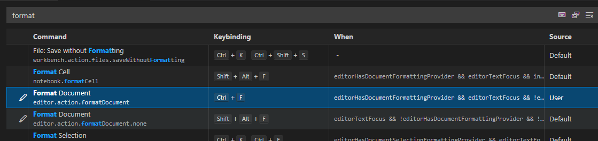

#### 代码格式化

- 在**vscode**里面存在一个手动格式化代码的配置，这个配置本人使用的比较频繁。如下图。如果你觉得配置好这个ide就能自动识别你的代码，那么你就很天真了，他还需要搭配一个格式化插件(比较出名的是prettier、beautify)。这里安装prettier，安装完毕后就需要在工作区里面配置两个文件
  1. `.prettierr.js`用于配置规则
  2. `.prettierignore`用于忽略某些文件不需要格式化的，有点类似`.eslintignore`、`.gitignore`

当然这仅仅是在格式化代码层面上的优化，那么怎么做到在代码语法层面上面的优化呢？比方说有一些代码在`javascript`环境下是不允许输入的，有一些代码需要告警提示的，还有一些代码在文件保存后自动修复`fix`的。这样就需要使用到`eslint`修复了，至于是使用`eslint-plugin-vue`还是其它的`react`根据业务场景来设置。同样的也在工作区下面建立两个文件

1. `.eslintignore`需要忽略`eslint`校验的配置文件
2. `.eslintrc.js`具体`eslint`校验规则在这里面设置

